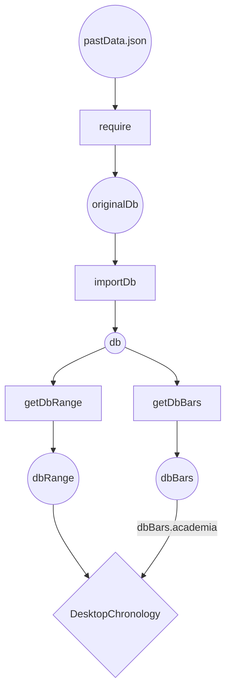

```mermaid
graph TB
  JSON((pastData.json)) --> require
  require --> originalDb((originalDb))
  originalDb --> importDb
  importDb --> db((db))
  db --> getDbRange
  getDbRange --> dbRange((dbRange))
  dbRange -->DesktopChronology
  db --> getDbBars
  getDbBars --> dbBars((dbBars))
  dbBars -->|dbBars.academia|DesktopChronology{DesktopChronology}
```
